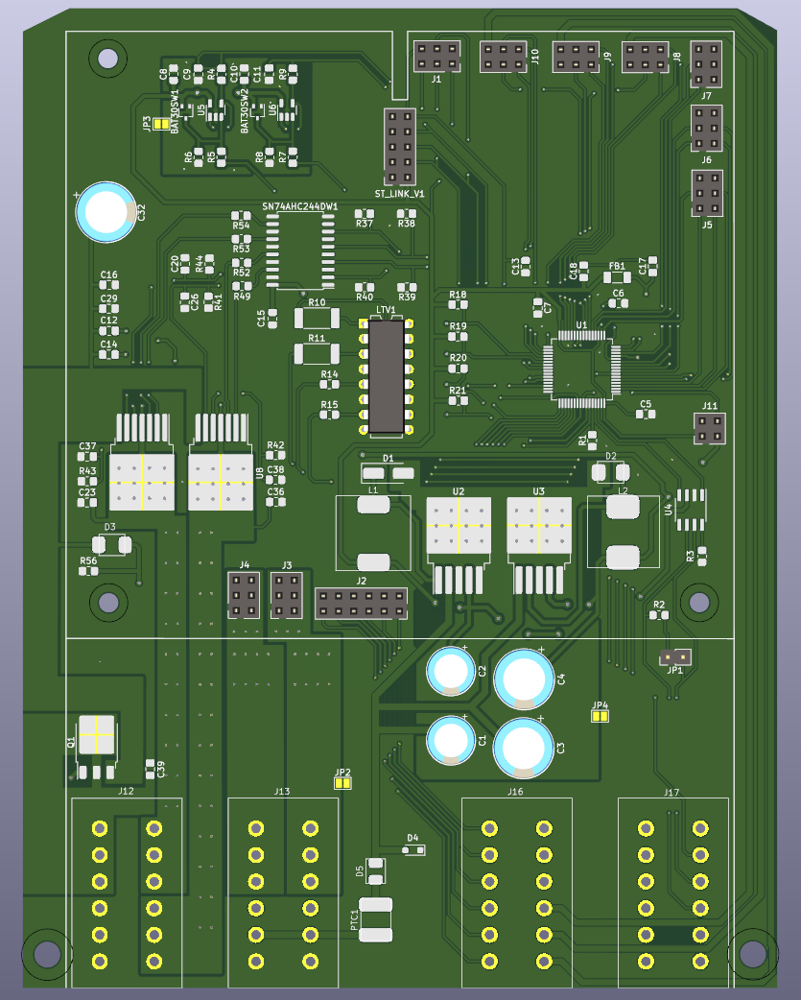
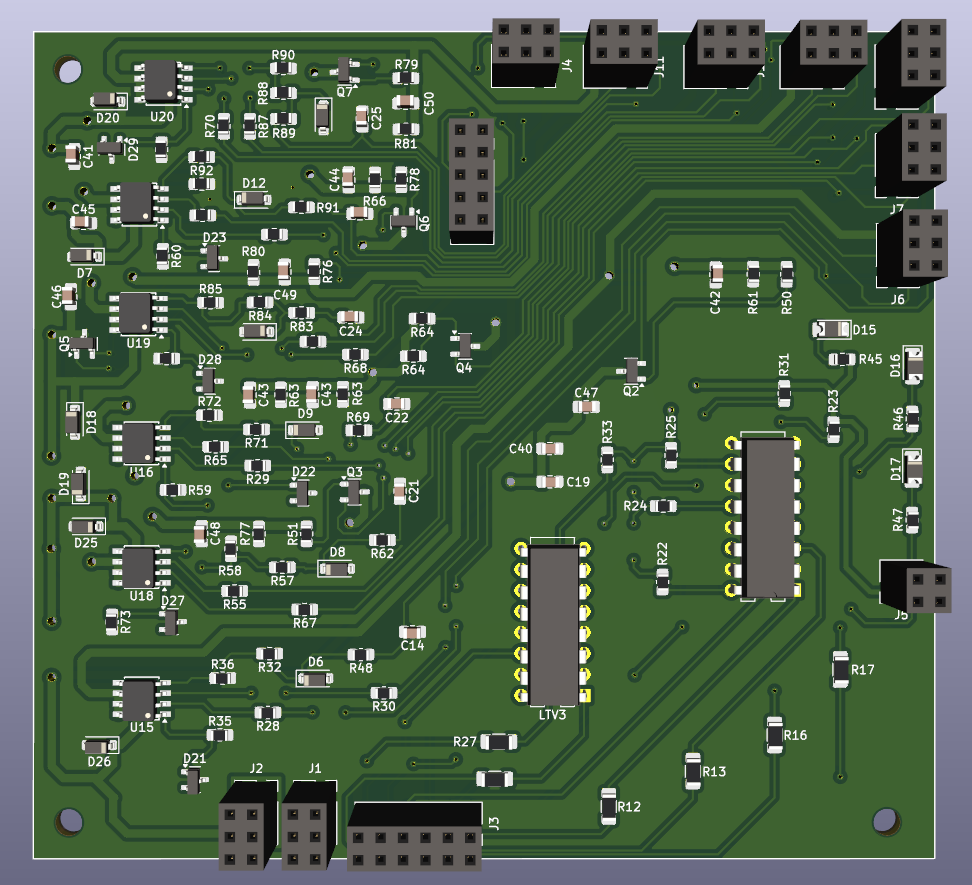
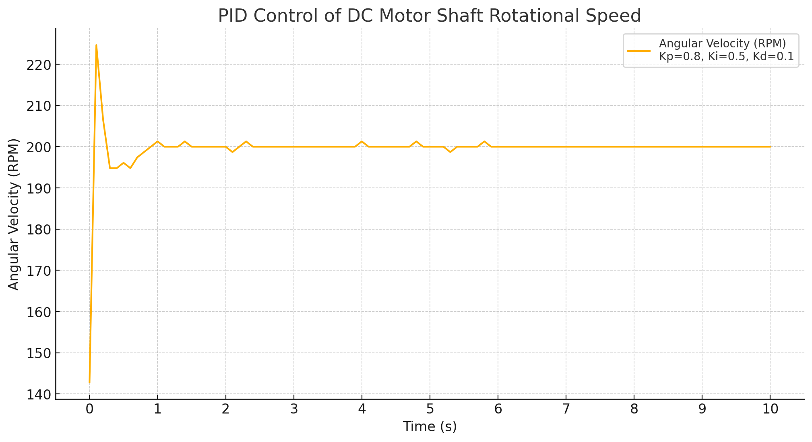
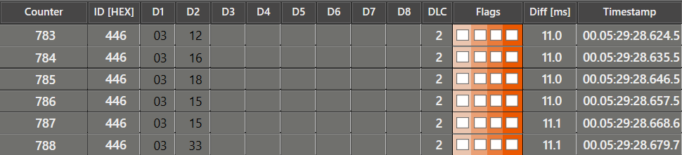

# DC Motor Controller for Row Seeder

## Project Description
This project focuses on the design and development of a modular DC motor controller system for a row seeder.
The system ensures precise control over seed dispensing and supports communication with external devices via CAN protocol.

The project consists of a main controller board an an extension board connected via 2.54mm pin sockets:
- **Main Controller Board**: Handles motor control, sensor readings and CAN communication protocol.
- **Extension Board**: Adds high-current switches and extra digital inputs for expanded functionality.

This modular approach allows future modifications for broader compatibility and functionality.

---

## Features
### Main Controller Board:
- **Microcontroller**: STM32L476RGT6 (low power, high-performance Cortex-M4).
- **DC Motor Control**: H-bridge driver with speed and direction regulation using PWM.
- **CAN Communication**: Communication interface enabled by an SN65HVD230 transceiver.
- **Sensor Inputs**:
  - Analog inputs (12V) for angle sensors.
  - Encoder inputs (5V and 12V) for speed control.

### Extension Board:
- **Digital Input Expansion**: Additional pins for external sensors or signals.
- **High-current Switches**: Reliable control of external loads through robust switches.
- **Modular Connectivity**: Connects seamlessly to the main board via pin sockets.

---

## PCB Renderings
- **Main Controller Board**:
  
  *Main Controller PCB*

- **Extension Board**:
  
  *Extension PCB made by my friend :)*

---

## Results
- **PWM Motor Control**: Verified precise speed and direction control for the DC motor.
- **Sensor Readings**: Successfully processed analog inputs and encoders.
- **PID Algorithm**: Achieved stable motor speed with minimal overshoot and fast response.
  
  *Example motor angular velocity step response (fs = 10Hz)*
- **CAN Communication**: Reliable message transmission with external systems.
  
  *Sending analog reading of distance sensor via CAN bus*
  
---

## CAN Identifiers Documentation

The following table includes example CAN IDs and their corresponding actions. These IDs are meant as examples and should be adjusted to fit the needs of the target hardware and system.

| ID      | Function                | Parameters                     | Message Type    | Notes                                     |
|---------|-------------------------|--------------------------------|-----------------|-------------------------------------------|
| 0x01    | Ping                    | None                           | Response        | Sends a "ping" response                   |
| 0x02    | Turn LED ON             | None                           | Request         | Turns on the LED                          |
| 0x03    | Turn LED OFF            | None                           | Request         | Turns off the LED                         |
| 0x04    | Toggle LED state        | None                           | Request         | Toggles the LED state                     |
| 0x05    | Read distance sensor    | ADC channel                    | Request         | Reads analog measurement from channel 6   |
| 0x06    | Read other sensor       | ADC channel                    | Request         | Reads analog measurement from channel 7   |
| 0x07    | Turn on switch 1        | GPIO_PIN_SET                   | Request         | Controls power switch 1                   |
| 0x08    | Turn on switch 2        | GPIO_PIN_SET                   | Request         | Controls power switch 2                   |
| 0x09    | Turn on switch 3        | GPIO_PIN_SET                   | Request         | Controls power switch 3                   |
| 0x10    | Turn on switch 4        | GPIO_PIN_SET                   | Request         | Controls power switch 4                   |
| 0x11    | Turn on switch 5        | GPIO_PIN_SET                   | Request         | Controls power switch 5                   |
| 0x12    | Turn on switch 6        | GPIO_PIN_SET                   | Request         | Controls power switch 6                   |
| 0x13    | Motor PID control       | RPM, direction                 | Request         | PID control for motor speed               |
| 0x14    | Stop motor              | None                           | Request         | Stops the motor                           |
| 0x15    | Motor percent control   | Percent, direction             | Request         | Controls motor using percentage duty cycle|

---

## Potential Improvements
- Support for a broader range of motors and sensors.
- Add more communication protocols and better diagnostic.
- Motor measurement for better motor control.
- Enhanced firmware for fault detection and recovery.

## Author
- **Name**: Krzysztof Tomicki
- **Contact**: tomicki.krzysztof.pv@gmail.com
  
